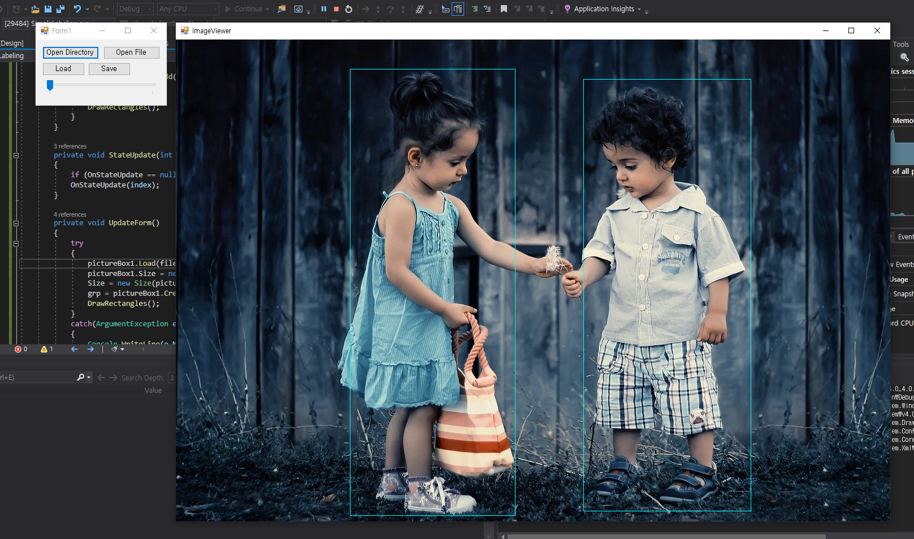

Simple Labeling
===============

This is a project to help with labeling.

#### Screenshot

How to use?
----------
Open the file or folder and label it. 
Use the arrow keys to move to the next or previous image.

#### Buttons
- Open Directory is Select an image directory to use.
- Open File is Select an image file to use.
- Load is Load csv file.
- Save is Save as csv file.

#### Mouse
- Left Click is Drag to select objects
- Right Click is Cancel the last selection.

#### Keyboard
- Left Key is Move to the previous image.
- Right Key is Moves to the next image.

CSV Format
----------
FILE_PATH, x1, x2, y1, y2
